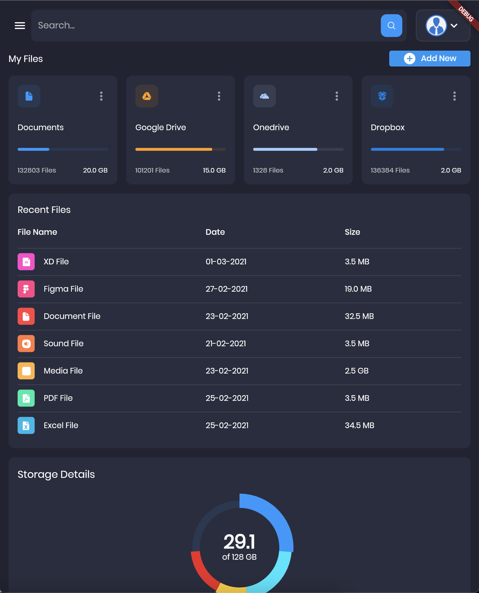

  <h1>Admin Panel or Dashboard Boilerplate</h1>

  <strong>is a Flutter App to Manage and Control all <a href="https://github.com/ialopezg/boilerplate" target="_blank">Boilerplate Platform</a> Business Logic</strong>

 

## 🔭 Technologies & Tools used

### OS & Environments supported

### Tools

  

### Programming Languages
[][cssplaylist]
[][cssplaylist]
[][cssplaylist]
[][cssplaylist]
[][cssplaylist]
[][cssplaylist]
[][webdevplaylist]
[][cssplaylist]
[][webdevplaylist]
  

See our Administrator [Live Demo](https://ialopezg.github.io/administrator/).

## Packages used ✨

- [provider](https://pub.dev/packages/provider). A wrapper around `InheritedWidget` to make them easier to use and more reusable.
- [flutter_svg](https://pub.dev/packages/flutter_svg). Draw `SVG` (and some Android VectorDrawable (XML)) files on a Flutter Widget.
- [google_fonts](https://pub.dev/packages/google_fonts). The `google_fonts` package for Flutter allows you to easily use any of the thousands of fonts available from fonts.google.com in your Flutter app.

## Screenshots ✨

## Contributors ✨

Thanks goes to these wonderful people ([emoji key](https://allcontributors.org/docs/en/emoji-key)):

<!-- ALL-CONTRIBUTORS-LIST:START - Do not remove or modify this section -->
<!-- prettier-ignore-start -->
<!-- markdownlint-disable -->
<table>
  <tr>
    <td align="center"><a href="https://github.com/ialopezg"> <b>Isidro A. López G.</b></a> <a href="#maintenance-RounakTadvi" title="Maintenance">🚧</a> <a href="https://github.com/abuanwar072/Flutter-Responsive-Admin-Panel-or-Dashboard/commits?author=RounakTadvi" title="Code">💻</a></td>
  </tr>
</table>

<!-- markdownlint-restore -->
<!-- prettier-ignore-end -->

<!-- ALL-CONTRIBUTORS-LIST:END -->

This project follows the [all-contributors](https://github.com/all-contributors/all-contributors) specification. Contributions of any kind welcome!

[website]: https://ialopezg.com
[course]: http://ialopezg.com
[twitter]: https://twitter.com/isidrolopezg
[youtube]: https://www.youtube.com/isidrolopezg
[instagram]: https://instagram.com/ialopezg
[linkedin]: https://linkedin.com/in/ialopezg
[webdevplaylist]: #
[jsplaylist]: #
[cssplaylist]: #
[reactplaylist]: #
